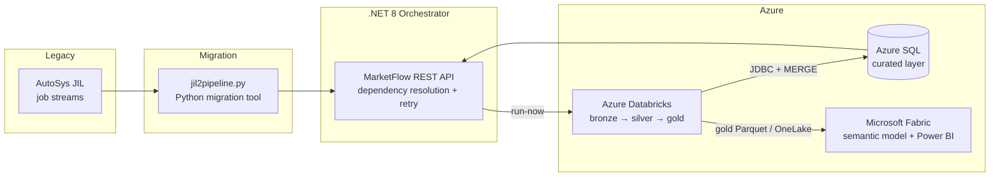

# MarketFlow

[](https://github.com/patelbhaveshdev/marketflow/actions/workflows/ci.yml)


**Enterprise trade data pipeline with legacy scheduler migration** — a sample
platform that mirrors how investment banks modernize batch processing: legacy
AutoSys job streams are migrated to a modern .NET orchestrator that drives
Azure Databricks transformations into Azure SQL and Microsoft Fabric.

Built from 25+ years of financial-services engineering experience, including a
real-world migration of **300+ enterprise scheduler jobs**.

## Architecture



## What this demonstrates

| Area | Where |
|------|-------|
| Legacy scheduler migration (AutoSys JIL → JSON pipelines) | [`scheduler/jil2pipeline.py`](scheduler/jil2pipeline.py) |
| Dependency resolution (topological sort, cycle detection) | [`src/MarketFlow.Core/Services/DependencyResolver.cs`](src/MarketFlow.Core/Services/DependencyResolver.cs) |
| Retry with exponential backoff + jitter | [`src/MarketFlow.Core/Services/RetryPolicy.cs`](src/MarketFlow.Core/Services/RetryPolicy.cs) |
| Minimal REST API with Swagger (.NET 8) | [`src/MarketFlow.Api/Program.cs`](src/MarketFlow.Api/Program.cs) |
| PySpark medallion pipeline (Auto Loader, dedupe, quarantine) | [`databricks/notebooks/`](databricks/notebooks) |
| Idempotent T-SQL MERGE + rollup procs | [`sql/`](sql) |
| Fabric OneLake shortcut + semantic model refresh | [`fabric/`](fabric) |
| Unit tests (xUnit + pytest) and GitHub Actions CI | [`.github/workflows/ci.yml`](.github/workflows/ci.yml) |

## Sample data

No Azure subscription needed to explore the data flow.
[`data/sample/trades_20260701.json`](data/sample/trades_20260701.json) ships with
230 OMS-style records (JSON Lines): 200 trades, 20 amendments (higher `version`,
exercises the dedupe window) and 10 bad records (exercises the quarantine path).

Regenerate any volume of data with the included generator:

```bash
python tools/generate_sample_trades.py --count 5000 --bad-rate 0.03 \
    --out data/sample/trades_$(date +%Y%m%d).json
```

Point the ingest notebook at the sample (see the comment in
`databricks/notebooks/01_ingest_raw_trades.py`) or upload it to DBFS on the
free Databricks Community Edition.

## Quick start

```bash
# 1. Migrate the legacy JIL streams to pipeline JSON
python scheduler/jil2pipeline.py \
    scheduler/jobs/daily_trades.jil scheduler/jobs/eod_reconciliation.jil \
    --out src/MarketFlow.Api/pipelines/trades_pipeline.json

# 2. Run the orchestrator API (Swagger UI opens at /swagger)
dotnet run --project src/MarketFlow.Api

# 3. Trigger the pipeline
curl -X POST http://localhost:5000/api/pipeline/run
```

```bash
# Tests
dotnet test            # xUnit: resolver, scheduler, retry policy
pytest scheduler -q    # migration tool
```

## REST API

| Method | Route | Purpose |
|--------|-------|---------|
| GET  | `/api/health` | Liveness probe |
| GET  | `/api/jobs` | Registered jobs (migrated from JIL) |
| GET  | `/api/jobs/{name}` | Single job detail |
| POST | `/api/jobs` | Register a new job |
| POST | `/api/pipeline/run` | Execute all jobs in dependency order |
| GET  | `/api/runs` | Run history with attempts and status |

## Repository layout

```
├── src/                    .NET 8 solution (API, core library, xUnit tests)
├── scheduler/              AutoSys JIL samples + Python migration tool + pytest
├── tools/                  Sample OMS trade data generator
├── data/sample/            Committed JSON Lines sample (230 records)
├── databricks/notebooks/   PySpark bronze/silver/gold notebooks
├── sql/                    Azure SQL schema and stored procedures
├── fabric/                 Microsoft Fabric pipeline + semantic model docs
└── .github/workflows/      CI: dotnet build/test, pytest, e2e migration check
```

## Roadmap

- [ ] Azure Batch / Databricks Jobs API executor implementations
- [ ] Persist run history to `curated.PipelineRunLog`
- [ ] Bicep templates for one-command Azure provisioning

## License

Bhavesh Patel
